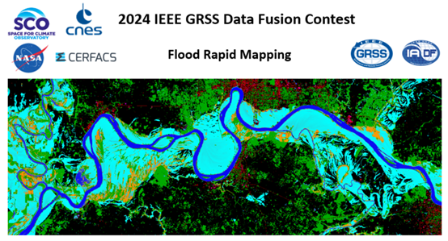

# Codes for 《 UANet: an Uncertainty-Aware Network for Building Extraction from Remote Sensing Images》

## About Paper
We are delighted to inform everyone that our paper has been successfully accepted by IEEE Transactions on Geoscience and Remote Sensing (TGRS 2024). 
[Paper Link](https://ieeexplore.ieee.org/document/10418227)

We are delighted to inform you that based on our proposed UANet, we have made improvements and successfully secured the double track championship in the **2024 IEEE GRSS Data Fusion Contest**.


The results on the three building datasets can be downloaded via Baidu Disk：[Link](https://pan.baidu.com/s/1MkoWfIyz7DADg37nUuMTgw?pwd=UANE) Code:UANE

We have released the codes of our UANet based on four backbones (*VGG, ResNet50, Res2Net-50, and PVT-v2-b2*). 

The whole training and testing framework of the paper have been released!

Our framwork has been deployed into application:


## Pretrained Backbones & Datasets:
We have provided the pretrained backbones(ResNet-50, Res2Net-50, PVT-v2-b2) and the processed datasets(WHU Building Dataset, Mass Building Dataset, Inria Building Dataset)

You can download the pretrained backbones via Baidu Disk [Link](https://pan.baidu.com/s/16sA3ZejzcItAWa2JE1G6vg?pwd=abmg) Code:abmg 

You can download the three building datasets via Baidu Disk [Link](https://pan.baidu.com/s/1sAE_NUf1NqnMQllAVJpM3g?pwd=UANe) Code: UANe

## Training Instructions

To train the UANet model, follow these steps:

1. Set the CUDA visible devices to specify the GPU for training. For example, to use GPU 0, run the following command:
   ```bash
   CUDA_VISIBLE_DEVICES=0 python Code/train.py -c config/whubuilding/UANet.py
2. Set the CUDA visible devices to specify the GPU for test. For example, to use GPU 0, run the following command:
   ```bash
   CUDA_VISIBLE_DEVICES=0 python Code/test.py -c config/whubuilding/UANet.py -o test_results/whubuilding/UANet/ --rgb

## Testing Instructions with Test Time Augmentation (TTA)

To perform testing with Test Time Augmentation (TTA), follow these steps:

1. Run the following command to perform testing with TTA:
   ```bash
   python Code/test.py -c config/whubuilding/UANet.py -o test_results/whubuilding/UANet/ -t lr --rgb

## Training Instructions for Multiple Training Sessions

If you want to continue training the model from a checkpoint or perform multiple training sessions, follow this:

1. Adjust the *pretrained_ckpt_path* in the config file.


## Reference
Our data processing  and whole framework are based on the [BuildFormer](https://github.com/WangLibo1995/BuildFormer). Here, we sincerely express our gratitude to the authors of that paper.

## Citation

We appreciate your attention to our work!

```bibtex
@ARTICLE{10418227,
  author={Li, Jiepan and He, Wei and Cao, Weinan and Zhang, Liangpei and Zhang, Hongyan},
  journal={IEEE Transactions on Geoscience and Remote Sensing}, 
  title={UANet: An Uncertainty-Aware Network for Building Extraction From Remote Sensing Images}, 
  year={2024},
  volume={62},
  number={},
  pages={1-13},
  keywords={Feature extraction;Uncertainty;Buildings;Data mining;Decoding;Remote sensing;Deep learning;Building extraction;remote sensing (RS);uncertainty-aware},
  doi={10.1109/TGRS.2024.3361211}}

